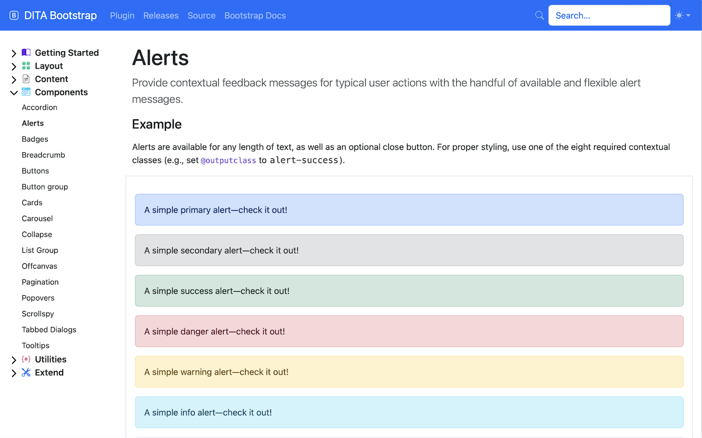

# DITA Bootstrap

A plug-in for [DITA Open Toolkit][1] that extends the default HTML5 output with a basic [Bootstrap][2] template.

<!-- MarkdownTOC levels="2,3" -->

- [Installing](#installing)
- [Using](#using)
- [Customizing](#customizing)
  - [Headers and footers](#headers-and-footers)
  - [Navigation menu](#navigation-menu)
  - [Custom CSS](#custom-css)
  - [Common Bootstrap utility classes](#common-bootstrap-utility-classes)
  - [Opt-In elements](#opt-in-elements)
- [Feedback](#feedback)
- [License](#license)

<!-- /MarkdownTOC -->



## Installing

Use the `dita` command to add this plug-in to your DITA Open Toolkit installation:

DITA-OT 3.5 and newer:

```console
dita install fox.jason.extend.css
dita install net.infotexture.dita-bootstrap
```

DITA-OT 3.3 and newer:

```console
dita --install fox.jason.extend.css
dita --install net.infotexture.dita-bootstrap
```

DITA-OT 3.2 and older:

```console
dita --install \
       https://github.com/jason-fox/fox.jason.extend.css/archive/master.zip
dita --install \
       https://github.com/infotexture/dita-bootstrap/archive/master.zip
```

## Using

Specify the `html5-bootstrap` format when building output with the `dita` command:

```console
dita --input=path/to/your.ditamap \
     --format=html5-bootstrap
```

## Customizing

### Headers and footers

The plug-in includes a default static navigation menu with a project name and global link placeholders.

The default header file `includes/bs-navbar-default.hdr.xml` uses the Bootstrap primary (blue) background color for the [navbar component][3].

To change the color to a dark (black) background, replace the primary background color class `bg-primary` on the first line with the dark variant `bg-dark`:

```diff
- <nav class="navbar navbar-expand-lg navbar-dark bg-primary">
+ <nav class="navbar navbar-expand-lg navbar-dark bg-dark">
```

You can edit a copy of this file to adjust the content of the global navigation. To override the global navigation with your own header, pass a custom header file to the `dita` command via the `--args.hdr` parameter:

```console
dita --input=path/to/your.ditamap \
     --format=html5-bootstrap \
     --args.hdr=path/to/your-header.xml
```

The plug-in includes a sample [header alternative with a light navbar][4].

No footer is added by default, but the plug-in also includes a sample [footer file][5]. To add a footer to the generated output, pass a custom footer file to the `dita` command via the `--args.ftr` parameter:

```console
dita --input=path/to/your.ditamap \
     --format=html5-bootstrap \
     --args.ftr=path/to/your-footer.xml
```

### Navigation menu

The plug-in extends the standard HTML5 table of contents (ToC) [navigation parameter][6] `--nav-toc` to add styled list groups to the navigation menu. (The navigation is rendered as a sidebar in desktop browsers and above the content on smaller devices.)

By default, the plug-in uses the `partial` option to include the current topic in the ToC along with its parents, siblings and children. As with the default HTML5 plug-in, the `full` option can also be used to generate a complete ToC for the entire map, or `none` to disable the table of contents entirely.

As of version 5.3.1, the plug-in provides five new options to style the table of contents navigation with the Bootstrap [list group][7] component , [nav][16] component and [collapsible][17] menus:

- `list-group-full` – Styled full ToC within a Bootstrap list group
- `list-group-partial` – Partial ToC with the current topic, parents, siblings, and children in a list group
- `nav-pill-full` – Styled full ToC using Bootstrap nav-pills
- `nav-pill-partial` – Partial ToC with the current topic, parents, siblings, and children using Bootstrap nav-pills
- `collapsible` – Styled full ToC with collapsible list elements

To use these options, pass the desired value to the `dita` command via the `--nav-toc` parameter:

```console
dita --input=path/to/your.ditamap \
     --format=html5-bootstrap \
     --nav-toc=list-group-partial
```

For an example of `collapsible` styling, see the output at [infotexture.github.io/dita-bootstrap][8].

Additionally, the first-level navigation menu can be switched to a horizontal Bootstrap menu bar to reduce the depth of the ToC.

To use this option, add the `--menubar-toc.include=yes` parameter to the `dita` command:

```console
dita --input=path/to/your.ditamap \
  --format=html5-bootstrap \
  --nav-toc=list-group-partial  \
  --menubar-toc.include=yes
```

### Custom CSS

Bootstrap themes can be generated via [Themestr.app][9]. The plug-in includes a sample placeholder for [custom CSS][10] styles. You can edit the `css/custom.css` file to replace the theme, or add style rules of your own.

To override the default theme, pass a custom CSS file to the `dita` command via the `--args.css` parameter:

```console
dita --input=path/to/your.ditamap --format=html5-bootstrap \
     --args.hdr=path/to/your-header.xml \
     --args.css=<name-of-css>.css \
     --args.copycss=yes \
     --args.csspath=css \
     --args.cssroot=path/to/your/theme
```


For more extensive customizations, you may want to [fork][11] this repository and create a new plug-in of your own.

### Common Bootstrap utility classes

The HTML output for the following DITA elements can be annotated with common Bootstrap utility classes for borders, background, text, spacing, etc. using additional command line parameters:

- `bootstrap.css.accessibility.link` – common Bootstrap utility classes for accessibility links
- `bootstrap.css.accessibility.nav` – common Bootstrap utility classes for accessibility navigation
- `bootstrap.css.accordion` – common utility classes for Bootstrap accordion components
- `bootstrap.css.card` – common utility classes for Bootstrap card components
- `bootstrap.css.carousel` – common utility classes for Bootstrap carousel components
- `bootstrap.css.carousel.caption` – common utility classes for Bootstrap carousel captions
- `bootstrap.css.codeblock` – common Bootstrap utility classes for DITA `<codeblock>` elements
- `bootstrap.css.dd` – common utility classes for DITA `<dd>` elements
- `bootstrap.css.dl` – common utility classes for DITA `<dl>` elements
- `bootstrap.css.dt` – common utility classes for DITA `<dt>` elements
- `bootstrap.css.figure` – common utility classes for DITA `<fig>` elements
- `bootstrap.css.figure.caption` – common utility classes for DITA figure titles
- `bootstrap.css.figure.image` – common utility classes for images within DITA`<fig>` elements
- `bootstrap.css.nav.parent` – common utility classes for ancestors of active nav-pill elements
- `bootstrap.css.pagination` – common utility classes for Bootstrap pagination components
- `bootstrap.css.section.title` – common Bootstrap utility classes for DITA `<section>` titles
- `bootstrap.css.shortdesc` – common Bootstrap utility classes for DITA`<shortdesc>` elements
- `bootstrap.css.table` – common utility classes for DITA `<table>` elements
- `bootstrap.css.tabs` – common utility classes for Bootstrap horizontal tab components
- `bootstrap.css.tabs.vertical` – common utility classes for Bootstrap vertical tabs
- `bootstrap.css.thead` – common utility classes for DITA `<thead>` elements
- `bootstrap.css.topic.title` – common Bootstrap utility classes for DITA `<topic>` titles

You can add your own XSLT customizations by creating a new plug-in that extends the DITA Bootstrap XSLT transforms. Just amend `args.xsl` to point to your own XSLT files. An [XSLT template][12] is included within this repository.

### Opt-In elements

For performance reasons, Bootstrap icons, popovers and tooltips are disabled by default, they can be enabled by using the following command line parameters:

- `icons.include` – enable Bootstrap icons
- `popovers.include` – enable Bootstrap popover components and tooltip components
- `bidi.include` - whether to include support for RTL languages

Breadcrumbs and menu bars can be added using the following parameters

- `args.breadcrumbs` – add Bootstrap breadcrumb components
- `menubar-toc.include` – add a Bootstrap menubar

## Feedback

- If you find this useful and build something of your own on top of it, [let me know][13].

- If you find a bug or would like to suggest a change, [create an issue][14].  
  _(If it’s a bug, provide steps to recreate the issue.)_

- If you know how to fix it yourself, [submit a pull request][15] with the proposed changes.

## License

[Apache 2.0](LICENSE) © 2017–2023 Roger W. Fienhold Sheen

Within the sample documentation, where necessary, the texts describing the usage of each component have been copied directly from the official [Bootstrap 5.3 documentation][2], however DITA markup is used throughout the examples describing how to implement these components correctly using `outputclass`. The text is therefore a derivative of "Bootstrap 5.3 docs" by Twitter, Inc. and the Bootstrap Authors, and used under CC BY 3.0.

[1]: http://www.dita-ot.org
[2]: https://getbootstrap.com/docs/5.3
[3]: https://getbootstrap.com/docs/5.3/examples/navbars/
[4]: ./includes/bs-navbar-light.hdr.xml
[5]: ./includes/bs-footer-example.xml
[6]: https://www.dita-ot.org/dev/parameters/parameters-html5.html#html5__nav-toc
[7]: https://getbootstrap.com/docs/5.3/components/list-group/
[8]: https://infotexture.github.io/dita-bootstrap
[9]: https://themestr.app/theme
[10]: ./css/custom.css
[11]: https://help.github.com/articles/fork-a-repo/
[12]: ./xsl/html5-bootstrap-template.xsl
[13]: https://twitter.com/infotexture
[14]: https://github.com/infotexture/dita-bootstrap/issues/new
[15]: https://help.github.com/articles/using-pull-requests/
[16]: https://getbootstrap.com/docs/5.3/components/navs-tabs/#pills
[17]: https://getbootstrap.com/docs/5.3/components/collapse/
